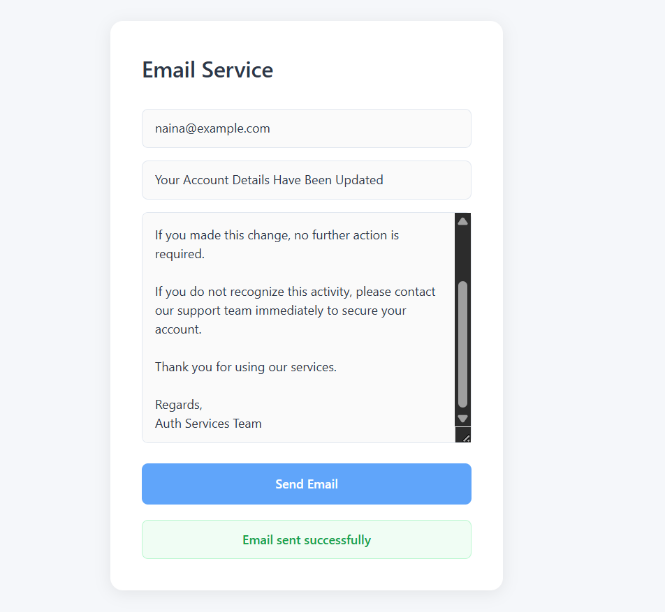
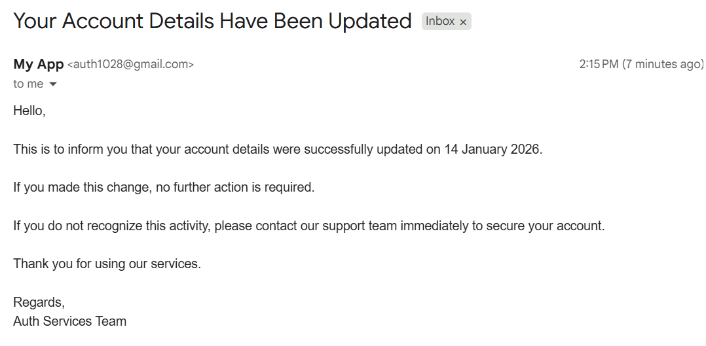

# Independent Email Service

> A stateless email-sending microservice with an intuitive test interface

[](https://nodejs.org/)
[](https://expressjs.com/)
[](https://nodemailer.com/)
[](https://reactjs.org/)
[](LICENSE)

## Overview

A lightweight, reusable email-sending microservice built with Node.js, Express, and Nodemailer. Send transactional emails, notifications, and alerts through a simple REST API with support for any SMTP provider.

### Why This Service?

- **Decouples email logic** from your main application
- **Reusable microservice** that integrates with any project via REST API
- **Stateless architecture** - no database or session management needed
- **SMTP flexibility** - works with Gmail, Outlook, SendGrid, or custom SMTP servers
- **Easy testing** - includes optional React UI for sending emails without Postman

## Features

- RESTful API for email delivery
- SMTP support (Gmail, Outlook, custom providers)
- Dynamic email content with text and HTML support
- Attachment support (optional)
- Input validation and error handling
- Clean MVC architecture
- Optional React test interface

> **Note:** This service handles outbound email sending only. Inbox management and receiving emails are handled by your SMTP provider (Gmail, Outlook, etc.).

## Technology Stack

**Backend:**
- Node.js + Express.js
- Nodemailer (email transport)
- CORS middleware
- dotenv for configuration

**Frontend (Optional Test UI):**
- React 18 + Vite
- Fetch API for HTTP requests
- Responsive CSS

## Project Structure

```
email-service/
│
├── backend/
│   ├── controllers/          # Request handlers
│   ├── routes/              # API endpoints
│   ├── services/            # Email sending logic
│   ├── config/              # Nodemailer + SMTP configuration
│   ├── utils/               # Validation helpers
│   ├── index.js             # Entry point
│   └── .env                 # SMTP credentials
│
├── frontend/                # Optional test UI
│   ├── src/
│   │   ├── App.jsx          # Main component
│   │   └── main.jsx         # Entry point
│   └── vite.config.js
│
└── screenshots/
    ├── ToSendEmail.png
    └── emailsent.png
```

## Quick Start

### Prerequisites

- Node.js 16.x or higher
- npm 7+
- SMTP credentials (Gmail App Password or other provider)

### Installation

**1. Clone the repository**

```bash
git clone <your-repository-url>
cd independent-email-service
```

**2. Backend Setup**

```bash
cd backend
npm install
```

Create a `.env` file inside the `backend/` folder:

```env
PORT=5001

SMTP_HOST=smtp.gmail.com
SMTP_PORT=465
SMTP_SECURE=true

SMTP_USER=your-email@gmail.com
SMTP_PASS=your-app-password
SMTP_FROM=Independent Email Service <your-email@gmail.com>
```

Start the backend:

```bash
node index.js
```

Backend runs at `http://localhost:5001`

**3. Frontend Setup (Optional Test UI)**

Open a new terminal:

```bash
cd frontend
npm install
npm run dev
```

Frontend runs at `http://localhost:5173`

**4. Test the Application**

1. Open `http://localhost:5173` in your browser
2. Enter recipient email, subject, and message
3. Click "Send Email"
4. Check confirmation message and recipient inbox

**Quick Test Example:**
```
To: test@example.com
Subject: Test Email
Message: Hello! This is a test email from the Independent Email Service.
```

## Screenshots

### Email Test Interface


*Simple, intuitive interface for composing and sending emails*

### Email Sent Confirmation


*Real-time confirmation with message ID after successful delivery*

## API Documentation

### Send Email

**Endpoint**

```http
POST http://localhost:5001/api/email/send
```

**Request Body**

```json
{
  "to": "recipient@example.com",
  "subject": "Account Update",
  "text": "Your account details were successfully updated."
}
```

| Field | Type | Required | Description |
|-------|------|----------|-------------|
| `to` | string | Yes | Recipient email address |
| `subject` | string | Yes | Email subject line |
| `text` | string | No | Plain text content |
| `html` | string | No | HTML formatted content |

> **Note:** At least one of `text` or `html` must be provided.

**Response**

Success (200 OK):
```json
{
  "success": true,
  "message": "Email sent successfully",
  "messageId": "abc123xyz@gmail.com"
}
```

Error (400 Bad Request):
```json
{
  "success": false,
  "error": "Missing required field: to"
}
```

Error (500 Internal Server Error):
```json
{
  "success": false,
  "error": "Failed to send email"
}
```

**Example using cURL**

```bash
curl -X POST http://localhost:5001/api/email/send \
  -H "Content-Type: application/json" \
  -d '{
    "to": "recipient@example.com",
    "subject": "Test Email",
    "text": "Hello from Independent Email Service!"
  }'
```

**Example using JavaScript**

```javascript
const response = await fetch('http://localhost:5001/api/email/send', {
  method: 'POST',
  headers: {
    'Content-Type': 'application/json',
  },
  body: JSON.stringify({
    to: 'recipient@example.com',
    subject: 'Welcome to Our Service',
    text: 'Thank you for signing up!'
  })
});

const data = await response.json();
console.log(data);
```

**Example with HTML Content**

```javascript
await fetch('http://localhost:5001/api/email/send', {
  method: 'POST',
  headers: { 'Content-Type': 'application/json' },
  body: JSON.stringify({
    to: 'user@example.com',
    subject: 'Account Verification',
    html: '<h1>Welcome!</h1><p>Click <a href="#">here</a> to verify your account.</p>'
  })
});
```

## SMTP Configuration Guide

### Gmail (Recommended)

**Requirements:**
- Use **App Password** (not your Gmail login password)
- Enable 2-Factor Authentication on your Google account
- Generate App Password from [Google Account Security](https://myaccount.google.com/security)

**Configuration:**
```env
SMTP_HOST=smtp.gmail.com
SMTP_PORT=465
SMTP_SECURE=true
SMTP_USER=your-email@gmail.com
SMTP_PASS=your-16-digit-app-password
```

**Common Ports:**
- `465` (SSL) ✅ Recommended
- `587` (STARTTLS) Alternative

### Outlook / Office 365

```env
SMTP_HOST=smtp.office365.com
SMTP_PORT=587
SMTP_SECURE=false
SMTP_USER=your-email@outlook.com
SMTP_PASS=your-password
```

### Custom SMTP Server

```env
SMTP_HOST=mail.yourdomain.com
SMTP_PORT=587
SMTP_SECURE=false
SMTP_USER=noreply@yourdomain.com
SMTP_PASS=your-password
```

## Architecture

### Stateless Design

```
Request → Send Email → Response
```

- No database required
- No session management
- Each request is independent
- Easy to scale horizontally

### Clean Code Structure

```
Routes → Controllers → Services → Nodemailer
```

Each layer has clear responsibilities:
- **Routes**: Define API endpoints
- **Controllers**: Handle request/response logic
- **Services**: Core email sending logic
- **Config**: SMTP transport configuration

## Configuration

### Environment Variables

Create a `.env` file in the backend directory:

```env
# Server Configuration
PORT=5001
NODE_ENV=development

# SMTP Configuration
SMTP_HOST=smtp.gmail.com
SMTP_PORT=465
SMTP_SECURE=true

# Email Credentials
SMTP_USER=your-email@gmail.com
SMTP_PASS=your-app-password

# Sender Information
SMTP_FROM=Independent Email Service <your-email@gmail.com>

# CORS Configuration (Optional)
CORS_ORIGIN=http://localhost:5173
```

### Optional Enhancements

#### Input Validation

```bash
npm install express-validator
```

```javascript
const { body, validationResult } = require('express-validator');

app.post('/api/email/send', [
  body('to').isEmail().withMessage('Invalid email address'),
  body('subject').notEmpty().withMessage('Subject is required'),
  body('text').optional().isString(),
  body('html').optional().isString()
], async (req, res) => {
  const errors = validationResult(req);
  if (!errors.isEmpty()) {
    return res.status(400).json({ errors: errors.array() });
  }
  // Process email
});
```

#### Rate Limiting

```bash
npm install express-rate-limit
```

```javascript
const rateLimit = require('express-rate-limit');

const emailLimiter = rateLimit({
  windowMs: 15 * 60 * 1000, // 15 minutes
  max: 50, // limit each IP to 50 requests per window
  message: 'Too many email requests, please try again later'
});

app.use('/api/email/', emailLimiter);
```

#### Logging

```bash
npm install winston
```

```javascript
const winston = require('winston');

const logger = winston.createLogger({
  level: 'info',
  format: winston.format.json(),
  transports: [
    new winston.transports.File({ filename: 'email.log' })
  ]
});

logger.info('Email sent', { to: recipient, messageId: info.messageId });
```

## Troubleshooting

### Email Sending Fails

**Symptom:** Error message "connect ECONNREFUSED 127.0.0.1:587"

**Causes:**
- `.env` file not found or not loaded
- SMTP configuration is incorrect
- Missing SMTP credentials

**Solutions:**
- Ensure `.env` file is in the `backend/` directory
- Verify `dotenv.config()` is called at the top of `index.js`
- Double-check SMTP_HOST, SMTP_PORT, SMTP_USER, and SMTP_PASS
- Ensure no spaces in `.env` values

```javascript
// index.js - Should be at the very top
require('dotenv').config();

const express = require('express');
// ... rest of code
```

### Emails Not Received

**Symptom:** API returns success but emails don't arrive

**Solutions:**
- Check recipient's spam/junk folder
- Verify SMTP credentials are correct
- For Gmail, ensure you're using App Password, not regular password
- Test with a different recipient email address
- Check SMTP provider's sending limits

### Gmail "Less Secure App" Error

**Symptom:** Authentication fails with Gmail

**Solution:**
Gmail no longer supports "less secure apps". You must:
1. Enable 2-Factor Authentication
2. Generate an App Password
3. Use the 16-digit App Password in `.env`

**Steps:**
1. Go to [Google Account Security](https://myaccount.google.com/security)
2. Enable 2-Step Verification
3. Go to App Passwords
4. Generate password for "Mail" on "Other device"
5. Copy the 16-digit password to `SMTP_PASS`

### CORS Errors

**Symptom:** Frontend can't reach backend API

**Solution:**

```javascript
const cors = require('cors');

app.use(cors({
  origin: process.env.CORS_ORIGIN || 'http://localhost:5173',
  credentials: true
}));
```

### Port Already in Use

**Symptom:** `Error: listen EADDRINUSE: address already in use :::5001`

**Solution:**
```bash
# Find and kill the process using port 5001
# On Windows
netstat -ano | findstr :5001
taskkill /PID <PID> /F

# On Mac/Linux
lsof -ti:5001 | xargs kill -9
```

Or change the port in `.env`:
```env
PORT=5002
```

## Docker Deployment (Optional)

> **Note:** Docker deployment is optional. The service works perfectly fine running directly with Node.js as shown in Quick Start.

**Backend Dockerfile:**

```dockerfile
FROM node:16-alpine
WORKDIR /app
COPY package*.json ./
RUN npm ci --only=production
COPY . .
EXPOSE 5001
CMD ["node", "index.js"]
```

**docker-compose.yml:**

```yaml
version: '3.8'

services:
  backend:
    build: ./backend
    ports:
      - "5001:5001"
    environment:
      - NODE_ENV=production
      - SMTP_HOST=${SMTP_HOST}
      - SMTP_PORT=${SMTP_PORT}
      - SMTP_SECURE=${SMTP_SECURE}
      - SMTP_USER=${SMTP_USER}
      - SMTP_PASS=${SMTP_PASS}
    restart: unless-stopped
  
  frontend:
    build: ./frontend
    ports:
      - "80:80"
    depends_on:
      - backend
    restart: unless-stopped
```

Deploy:

```bash
docker-compose up -d
```

## Testing

### Manual Testing with Frontend UI

1. Start both backend and frontend
2. Open `http://localhost:5173`
3. Fill in the form with test data
4. Click "Send Email"
5. Check for success message
6. Verify email in recipient inbox

### API Testing with Postman

**Setup:**
1. Create new POST request
2. URL: `http://localhost:5001/api/email/send`
3. Headers: `Content-Type: application/json`
4. Body (raw JSON):
```json
{
  "to": "test@example.com",
  "subject": "API Test",
  "text": "Testing email API"
}
```

### Automated Testing (Optional)

```bash
npm install --save-dev jest supertest
```

```javascript
// tests/email.test.js
const request = require('supertest');
const app = require('../index');

describe('Email API', () => {
  it('should send email successfully', async () => {
    const response = await request(app)
      .post('/api/email/send')
      .send({
        to: 'test@example.com',
        subject: 'Test',
        text: 'Test message'
      });
    
    expect(response.status).toBe(200);
    expect(response.body.success).toBe(true);
  });

  it('should return error for missing recipient', async () => {
    const response = await request(app)
      .post('/api/email/send')
      .send({
        subject: 'Test',
        text: 'Test message'
      });
    
    expect(response.status).toBe(400);
  });
});
```

## Security Considerations

### Production Best Practices

1. **Never commit `.env` file**
   - Add `.env` to `.gitignore`
   - Use environment variables in production

2. **Rate Limiting**
   - Prevent abuse and spam
   - Limit requests per IP address

3. **Input Validation**
   - Validate email addresses
   - Sanitize subject and content
   - Limit message size

4. **SMTP Security**
   - Use App Passwords (never regular passwords)
   - Enable TLS/SSL encryption
   - Restrict SMTP access by IP (if possible)

5. **API Security**
   - Add authentication (JWT tokens)
   - Implement API keys for service-to-service calls
   - Use HTTPS in production

6. **Logging & Monitoring**
   - Log all email attempts (success/failure)
   - Monitor for unusual patterns
   - Set up alerts for failures

## Future Enhancements

**Templates & Personalization:**
- HTML email templates (welcome, verification, invoice)
- Template variables and dynamic content
- Multi-language support

**Advanced Features:**
- File attachments (PDFs, images, documents)
- CC and BCC support
- Email scheduling (send later)
- Bulk email sending

**Reliability & Performance:**
- Queue system with retry logic (BullMQ + Redis)
- Email delivery tracking and analytics
- Webhook callbacks for delivery status
- Failover to backup SMTP providers

**Integration Options:**
- Alternative providers (SendGrid, AWS SES, Mailgun)
- Email logging and audit history (optional database)
- Unsubscribe link management
- Bounce and complaint handling

## Contributing

Contributions are welcome! Please follow these steps:

1. Fork the repository
2. Create a feature branch (`git checkout -b feature/email-templates`)
3. Commit your changes (`git commit -m 'Add email templates'`)
4. Push to the branch (`git push origin feature/email-templates`)
5. Open a Pull Request

## License

This project is licensed under the MIT License - see the [LICENSE](LICENSE) file for details.

## Author

**Naina Kothari**  
GitHub: [@NainaKothari-14](https://github.com/NainaKothari-14)

---

Built with [Nodemailer](https://nodemailer.com/) | Designed for modern microservice architecture
